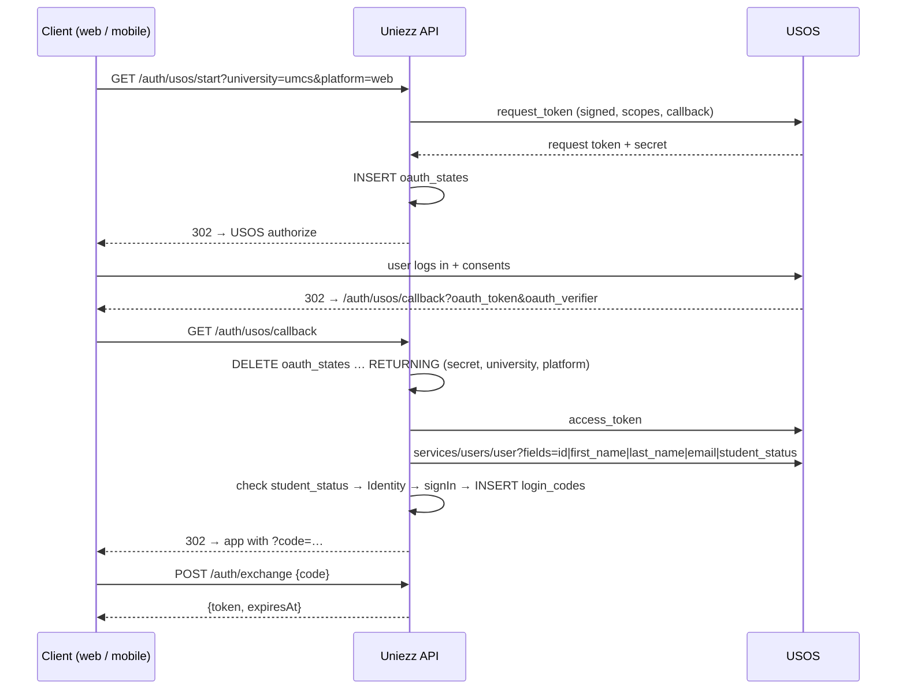

# Uniezz — Auth Implementation Plan

Step-by-step plan for implementing login (USOS and email OTP), users, and sessions on the Go API. It records the decisions we made while designing the `internal/auth` package and the order in which we build it.

**Scope:** USOS login (UMCS, UMLub), email OTP login (the other universities), user creation, sessions, and the handoff to the OTP developer. Entra ID is out of scope for now. See [Later](#later-out-of-scope).

**Relation to other docs:** [AUTHENTICATION.en.md](AUTHENTICATION.en.md) describes the product-level auth design, and [the brief](../briefs/auth-usos-architecture.md) describes the first architecture draft. Where this plan differs from them, this plan wins. The changes are listed in [Superseded decisions](#superseded-decisions).

---

## 1. Decisions

### 1.1 No shared "provider" interface — composition instead

USOS and OTP have different shapes:

- **USOS:** browser redirect → USOS login page → callback → token exchange.
- **OTP:** two JSON requests, "send code" and "verify code".

A common `Start/Complete` interface would leak, so we do not build one, and we do not use a Bridge pattern. The two methods meet at a single point: both produce a verified **`Identity`**. Everything after that point is shared:

```
USOS flow ─┐
           ├─► Identity ─► signIn (upsert user) ─► issue session ─► deliver to client
OTP flow ──┘
```

Platform (web or mobile) only matters at delivery, and a `switch` in one place is enough. We add no interface until there is a third case (YAGNI).

### 1.2 Interfaces are declared by the consumer, only at external boundaries

- **Handler → login logic (same package):** no interface. The handler holds the concrete struct.
- **External boundaries:** small interfaces declared **in `auth`**, containing exactly the methods `auth` calls. These are the USOS API client and the mail sender.
- **Accept interfaces, return structs:** `usos.NewClient(...)` returns `*usos.Client`, and `auth` accepts its own small `usosClient` interface.
- **Repositories** stay concrete structs and are tested against a real Postgres, as `session_repository_test.go` already does. We add an interface only if DB-backed tests become a real problem.
- **Fakes** are hand-written structs in `_test.go` files, not generated mocks. If several packages ever need the same fake, it moves to a `usostest` package (like `net/http/httptest`).

### 1.3 Naming

Files and types are named for what they do (`login.go`, `usos_login.go`), not for a pattern. We do not create `service.go`, `utils.go`, `manager.go`, or `bridge.go`.

### 1.4 Session tokens are returned to the client; the client stores them

Sessions use opaque random tokens (`SessionToken`: 32 random bytes; only the SHA-256 hash is stored). The API returns the token in JSON, and web and mobile decide where to keep it. Authenticated requests send `Authorization: Bearer <token>`.

### 1.5 USOS hands over the session through a one-time exchange code — on web and mobile

The USOS callback is a **browser navigation**, not a `fetch`, so there is no JavaScript to read a JSON response. The token also must not go into a redirect URL, where it would leak into browser history, server logs, and `Referer` headers. On Android, any app can also register the same URL scheme and intercept it.

So the callback redirects with a **one-time code** that lives 60 seconds, and the client trades that code for the token:

```
GET  /auth/usos/callback   → 302 {APP_WEB_URL}/auth/done?code=…        (web)
                           → 302 {APP_MOBILE_SCHEME}?code=…             (mobile)
POST /auth/exchange {code} → 200 {token, expiresAt}
```

Web and mobile use the same mechanism; only the redirect target differs. OTP needs no exchange: `POST /auth/otp/verify` is already a JSON request and returns the token directly.

### 1.6 Static data in code, secrets in env, wired once at startup

- **Code** (`university.go` registry): university ID, name, auth type, email domains, and the USOS base URL.
- **Env / Doppler:** consumer key and secret per USOS university.
- **`module.go`** builds a `map[UniversityID]usosClient` once at startup, from every university with `AuthTypeUSOS`. If credentials are missing, startup fails in `production`, and in `development` the university is disabled with a log line.
- The current `newConfig(...)`, which builds an OAuth config on every request, is removed.

### 1.7 Database conventions

- `snake_case` columns, `TIMESTAMPTZ` for timestamps.
- **No Postgres enums for open sets.** `university_id` is `VARCHAR(32)` everywhere and is validated in Go, so adding a university needs no migration. Closed, tiny sets (`platform`) use a `CHECK` constraint.
- One-time rows (OAuth state, login codes) are consumed with `DELETE … RETURNING` so they cannot be reused.

### 1.8 The USOS access token is not stored

We read the profile once during the callback and discard the token. If we later need to call USOS on the user's behalf (for example, to refresh their programme), the token goes into a separate table, encrypted at rest. This also means `offline_access` is not requested for now.

### 1.9 Only active students get in

"Is a student" is checked **inside each login method**, before an `Identity` is produced. Holding an `Identity` therefore means "verified, eligible student".

- **USOS:** `services/users/user` field `student_status`. We accept only the "active student" value (believed to be `2`: `0` = not a student, `1` = inactive, `2` = active — **verify against the instance docs**).
- **OTP:** the email domain must be in the university's `Domains`.

Student status is not stored as a column.

---

## 2. Target layout

```
internal/
  usos/                    USOS API client: OAuth 1.0a + typed endpoints. Knows nothing about users or sessions.
    client.go
    client_test.go         httptest.Server pretending to be USOS
  auth/
    module.go              composition root: builds clients, repositories, flows, handlers; registers routes
    university.go          university registry (exists; gains UsosBaseURL)
    identity.go            Identity + validation                                   ← contract
    login.go               logins: signIn(Identity) → User, issueSession(userID)   ← contract
    errors.go              sentinel errors + mapping to HTTP status
    user_repository.go     users upsert / lookup
    session_repository.go  (exists)
    session_token.go       (exists)
    login_code_repository.go
    session_handler.go     POST /auth/exchange, GET /auth/me, POST /auth/logout, bearer middleware
    usos_login.go          USOS flow logic: start, finish
    usos_state_repository.go
    usos_handler.go        GET /auth/usos/start, GET /auth/usos/callback
    otp_login.go           OTP flow logic: request, verify                          ← OTP developer
    otp_repository.go                                                               ← OTP developer
    otp_handler.go         POST /auth/otp/request, POST /auth/otp/verify            ← OTP developer
```

Later external clients (Entra, the mail provider) follow the same shape: their own client package, plus a small interface in `auth`.

---

## 3. Contracts

These are agreed and merged **before** USOS and OTP work continue in parallel. See [Step 3](#step-3--shared-contract-pr-unblocks-otp).

### 3.1 `Identity` (`identity.go`)

```go
var ErrInvalidIdentity = errors.New("invalid identity")

// Identity is a student verified by a login method (USOS or email OTP).
// A login method returns an Identity only after it has confirmed the person
// is an eligible student; signIn turns it into a user.
type Identity struct {
	UniversityID UniversityID

	// UsosUserID is the user's key at USOS universities.
	UsosUserID string
	// Email is the user's key at OTP universities; at USOS universities it is
	// optional profile data.
	Email string

	FirstName string
	LastName  string
}
```

`validate()` rules:

- The university must exist in the registry.
- Required fields depend on `University.AuthType`: USOS universities require `UsosUserID`, and OTP universities require `Email`. Without this rule, a UMCS identity carrying only an email would create a second account for the same person.
- There is no separate `Method` field, because the method follows from the university.
- `Identity` does not mutate itself. `signIn` normalizes it first (`normalizeEmail`, trimmed names) and then calls `validate()`.

### 3.2 Shared sign-in (`login.go`)

```go
type logins struct {
	users      *UserRepository
	sessions   *SessionRepository
	sessionTTL time.Duration
}

// signIn creates the user on first login, otherwise updates it, and records last_login_at.
func (l *logins) signIn(ctx context.Context, id Identity) (User, error)

// issueSession creates a session and returns the raw token — the only time it exists in plain form.
func (l *logins) issueSession(ctx context.Context, userID uuid.UUID) (IssuedSession, error)

type IssuedSession struct {
	Token     string    // base64url SessionToken
	ExpiresAt time.Time
}
```

`signIn` and `issueSession` are separate because USOS issues the session later, at `/auth/exchange`, while OTP issues it immediately after `verify`.

### 3.3 Interfaces at boundaries

```go
// usos_login.go
type usosClient interface {
	RequestToken(ctx context.Context, callbackURL string) (usos.RequestToken, error) // token, secret, authorize URL
	AccessToken(ctx context.Context, rt usos.RequestToken, verifier string) (usos.AccessToken, error)
	CurrentUser(ctx context.Context, at usos.AccessToken) (usos.User, error)
}

// otp_login.go (owned by the OTP developer)
type otpMailer interface {
	SendOTP(ctx context.Context, to, code string) error
}
```

### 3.4 Routes

| Method | Route | Owner | Request → Response |
|--------|-------|-------|--------------------|
| `GET` | `/auth/universities` | shared | → `[{id, name, authType}]` |
| `GET` | `/auth/usos/start?university=umcs&platform=web` | USOS | → `302` to the USOS authorize page |
| `GET` | `/auth/usos/callback` | USOS | → `302` to web or mobile with `?code=` (or `?error=`) |
| `POST` | `/auth/exchange` | shared | `{code}` → `{token, expiresAt}` |
| `POST` | `/auth/otp/request` | OTP | `{university, email}` → `204` |
| `POST` | `/auth/otp/verify` | OTP | `{university, email, code}` → `{token, expiresAt}` |
| `GET` | `/auth/me` | shared | bearer → current user |
| `POST` | `/auth/logout` | shared | bearer → `204`, session deleted |

`/auth/usos/start` is a `GET` because the browser (web) or an in-app browser tab (mobile: `ASWebAuthenticationSession` / Custom Tabs) navigates to it directly. There is **one callback for all USOS universities**: the university and platform are read back from `oauth_states` by request token.

### 3.5 Errors → HTTP

Login logic returns sentinel errors, and the handler maps them in one function. Internal errors are logged with detail, and the client gets a generic message.

| Error | Status |
|-------|--------|
| malformed input / callback params | `400` |
| `ErrInvalidIdentity` | `400` |
| `ErrStateNotFound` (unknown or expired OAuth state) | `400` |
| `ErrInvalidCode` (exchange or OTP code wrong/expired/used) | `401` |
| `ErrNotStudent` | `403` |
| `ErrRateLimited` (OTP) | `429` |
| upstream USOS failure | `502` |
| anything else | `500` |

On the USOS callback, the user is looking at a browser tab, so once the state (and therefore the platform) is known, errors **redirect** to the client with `?error=not_student|failed`. They do not render plain text. Only an unknown state falls back to a plain `400`.

---

## 4. Data model

### 4.1 `users` — add profile fields

Migration `20261003111501_users_profile_fields.sql` (draft exists):

```sql
ALTER TABLE users
    ADD COLUMN first_name VARCHAR(100),
    ADD COLUMN last_name VARCHAR(100),
    ADD COLUMN last_login_at TIMESTAMPTZ;
```

The columns are nullable because OTP only knows the email; OTP users fill in their profile themselves.

`users` stays the **account** table: login keys, names, and login timestamps. The social **profile** (bio, avatar `avatar_key` in S3, programme and faculty, privacy settings) goes into a separate `profiles` table when the first profile endpoint is built. It changes often and should not churn the auth table.

### 4.2 `oauth_states` — rewrite

The current migration has bugs:

- `platform` and `provider` are `NOT NULL`, but the `INSERT` does not set them.
- The `PROVIDER` enum (`'umcs','um'`) does not match the registry (`umlub`).
- The camelCase columns get folded to lowercase.
- The `Down` section drops the index after the table, so rollback fails.

This branch is not merged yet, so we **edit the migration in place**:

```sql
-- +goose Up
CREATE TABLE oauth_states (
    request_token  TEXT PRIMARY KEY,
    request_secret TEXT NOT NULL,
    university_id  VARCHAR(32) NOT NULL,
    platform       VARCHAR(16) NOT NULL CHECK (platform IN ('web', 'mobile')),
    expires_at     TIMESTAMPTZ NOT NULL DEFAULT NOW() + INTERVAL '10 minutes'
);

-- +goose Down
DROP TABLE oauth_states;
```

The primary key on `request_token` doubles as the lookup index. To re-apply on a local DB, fix the file first, because `goose down` runs the file's current `Down` section. Then run `mise run migrate:down` followed by `mise run migrate:up`.

### 4.3 `login_codes` — new

```sql
CREATE TABLE login_codes (
    code_hash  BYTEA PRIMARY KEY,
    user_id    UUID NOT NULL REFERENCES users(id) ON DELETE CASCADE,
    expires_at TIMESTAMPTZ NOT NULL,
    created_at TIMESTAMPTZ NOT NULL DEFAULT NOW()
);
```

The code is a random 32-byte value, and only its SHA-256 hash is stored, the same as session tokens. `POST /auth/exchange` runs `DELETE FROM login_codes WHERE code_hash = $1 AND expires_at > NOW() RETURNING user_id`, then calls `issueSession`.

### 4.4 Upsert rules

Each university uses one key: `(university_id, usos_user_id)` for USOS and `(university_id, LOWER(email))` for OTP. Both unique indexes already exist.

```sql
INSERT INTO users (university_id, usos_user_id, email, first_name, last_name, last_login_at)
VALUES ($1, $2, $3, $4, $5, NOW())
ON CONFLICT (university_id, usos_user_id) WHERE usos_user_id IS NOT NULL
DO UPDATE SET
    first_name    = COALESCE(users.first_name, EXCLUDED.first_name),
    last_name     = COALESCE(users.last_name,  EXCLUDED.last_name),
    email         = COALESCE(users.email,      EXCLUDED.email),
    last_login_at = NOW()
RETURNING …;
```

`COALESCE` keeps names the user has edited in their profile. See [open question 2](#9-open-questions).

---

## 5. USOS flow



**USOS client notes (`internal/usos`):**

- `http.Client` with a timeout (10 s). `context.Context` on every call.
- The endpoint base URL comes from the registry (`https://apps.umcs.pl`, `https://usosapps.umlub.pl`). Paths are `/services/oauth/{request_token,authorize,access_token}`.
- **Scopes** are passed on the `request_token` call. USOS joins them with `|`. Plan: `studies|email`. `dghubble/oauth1` does not have a scopes option, so check that adding `scopes` as a query parameter on the request-token URL is included in the signature. This is the first thing to verify in step 5.
- `services/users/user` requires an explicit `fields` list. Request only what we use, and discard anything sensitive at read time.
- Test with an `httptest.Server` that serves canned USOS responses, covering signing, JSON parsing, and error statuses.

---

## 6. Configuration

| Variable | Status | Purpose |
|----------|--------|---------|
| `DATABASE_URL` | exists | Postgres |
| `GOOSE_DBSTRING` | exists (Doppler, `dev` only) | `${DATABASE_URL}` reference for goose — add to `stg` and `prd` |
| `BACKEND_PUBLIC_URL` | exists | builds the callback URL `{BACKEND_PUBLIC_URL}/auth/usos/callback` |
| `APP_WEB_URL` | exists | web redirect target after login; also the CORS origin |
| `APP_MOBILE_SCHEME` | exists | mobile deep link / universal link, e.g. `uniezz://auth/callback` |
| `<UNIID>_USOS_CONSUMER_KEY` / `_SECRET` | exists (`UMCS_`, `UMLUB_`) | USOS credentials per university |
| `SESSION_TTL` | new | session lifetime, default `720h` (30 days) |

The USOS `BaseURL` moves from `config.go` into the university registry, because it is public static data. `config` keeps only the credentials.

---

## 7. Implementation steps

Each step is small, at most 1–3 files plus tests, and ends in a green `mise run test`.

### Step 1 — Identity and users schema
- `identity.go` per [3.1](#31-identity-identitygo) + `identity_test.go` (table test: unknown university, USOS without ID, OTP without email, valid cases).
- Migration `users_profile_fields` per [4.1](#41-users--add-profile-fields).
- **Done when:** the migration applies and rolls back cleanly, and the tests pass.

### Step 2 — User repository
- `user_repository.go`: `User` struct, `UpsertByUsosID`, `UpsertByEmail`, `GetByID`.
- DB-backed tests: first login creates the user, a second login updates `last_login_at` and keeps edited names, and the same USOS ID at two different universities gives two users.

### Step 3 — Shared contract PR (unblocks OTP)
- `login.go` (`signIn`, `issueSession`), `errors.go`, and the routes in `module.go` registered as stubs returning `501`.
- `otpMailer` interface declaration.
- **Merge this PR before parallel work starts.** After it, the OTP developer needs nothing else from the USOS side. See [section 8](#8-otp-task-for-the-second-developer).

### Step 4 — Fix `oauth_states`; config cleanup
- Rewrite the migration per [4.2](#42-oauth_states--rewrite).
- Add `UsosBaseURL` to the registry, keep only credentials in `config`, and add `SESSION_TTL`.
- `go mod tidy` (fixes `dghubble/oauth1` being marked `// indirect`).

### Step 5 — `internal/usos` client
- `client.go`: `NewClient(baseURL, key, secret, httpClient) *Client`, `RequestToken`, `AccessToken`, `CurrentUser`.
- `client_test.go` against `httptest.Server`.
- Verify the scopes signing question from [section 5](#5-usos-flow).

### Step 6 — USOS login flow
- `usos_state_repository.go`: `Save`, `Take` (`DELETE … RETURNING`).
- `usos_login.go`: `start(university, platform) → authorizeURL`, `finish(requestToken, verifier) → (platform, User)`. The `ErrNotStudent` check lives here.
- Tests with a fake `usosClient` and a real DB.

### Step 7 — Exchange code and session endpoints
- `login_codes` migration + `login_code_repository.go`.
- `session_handler.go`: `POST /auth/exchange`, bearer middleware (`Authorization: Bearer`) → user in context, `GET /auth/me`, `POST /auth/logout`.

### Step 8 — USOS handlers and wiring
- `usos_handler.go`: `start` and `callback`, implemented as methods rather than closures. Input parsing → logic → error mapping → redirect.
- `module.go` builds everything once at startup ([1.6](#16-static-data-in-code-secrets-in-env-wired-once-at-startup)).
- Manual end-to-end check against real UMCS USOS on `dev`.

### Step 9 — Hardening
- CORS for `APP_WEB_URL`.
- Daily cleanup of expired `oauth_states`, `login_codes`, and `sessions`.
- **PKCE-style binding for mobile:** the app sends `code_challenge` on `/auth/usos/start`, and `/auth/exchange` requires the matching `code_verifier`. A hijacked deep link is then useless.
- Rate limiting on `/auth/exchange`.

---

## 8. OTP task for the second developer

**Starts after:** the Step 3 PR is merged.

**Owns:** `otp_login.go`, `otp_repository.go`, `otp_handler.go`, their tests, and the mailer implementation (its own package, satisfying `otpMailer`).

**Table:** `otp_requests` already exists (`migrations/20260927132746_otp_request.sql`).

**Flow:**

1. `POST /auth/otp/request {university, email}`
   - The university must exist and have `AuthTypeOTP`, and the email domain must be in `University.Domains`. Otherwise return `400`.
   - Rate limits (from AUTHENTICATION.en.md): 3 codes per email per hour, 10 per IP per hour. Otherwise return `429`.
   - Cancel previous active codes for that email, generate a 6-digit code with `crypto/rand`, store its hash, and send it through `otpMailer`.
   - Always return `204`, so the response does not reveal whether an account exists.
2. `POST /auth/otp/verify {university, email, code}`
   - Find the latest active request, increment `attempts_count`, and burn the code at `max_attempts`.
   - Compare hashes in constant time (`crypto/subtle`) and set `consumed_at`.
   - Build an `Identity{UniversityID, Email}`, then call `signIn` and `issueSession`, and return `{token, expiresAt}`.

**Rules (same as USOS):** logic in `otp_login.go`, HTTP only in `otp_handler.go`, errors from [3.5](#35-errors--http), a hand-written fake mailer in tests, and DB-backed repository tests.

**Done when:** the full request → verify → `/auth/me` path works with the fake mailer in tests and with the real mailer on `dev`.

---

## 9. Open questions

| # | Question | Recommendation |
|---|----------|----------------|
| 1 | Which `student_status` values are allowed? | Active students only. Confirm the numeric values in the UMCS/UMLub API docs |
| 2 | Should names be overwritten from USOS on every login? | No. Fill only empty names (`COALESCE`), so user edits survive |
| 3 | Scopes: `studies` and `email` now? `personal` (date of birth, which brings PESEL with it) and `photo`? | `studies` and `email` now, to avoid asking users to re-consent later. Decide on `personal` and `photo` when profiles and S3 exist |
| 4 | Store programme and faculty from `studies` now? | Only once the `profiles` table exists (Step 9+) |
| 5 | Session TTL and sliding expiry? | 30 days fixed for now; sliding expiry later |

---

## Superseded decisions

| Earlier docs | This plan |
|--------------|-----------|
| `AuthProvider { start, callback }` interface | No shared interface. Each method produces an `Identity` ([1.1](#11-no-shared-provider-interface--composition-instead)) |
| `POST /auth/start`, `GET /auth/callback/:provider` | Per-method routes: `/auth/usos/*` and `/auth/otp/*` ([3.4](#34-routes)) |
| Refresh token in an `HttpOnly` cookie + 15-minute JWT | One opaque session token returned in JSON, sent as a bearer token ([1.4](#14-session-tokens-are-returned-to-the-client-the-client-stores-them)) |
| `NormalizedProfile` with verification levels | `Identity` with only the fields needed to create a user. Verification level and profile fields come with `profiles` |
| `offline_access`; access tokens stored encrypted | No USOS token stored for now ([1.8](#18-the-usos-access-token-is-not-stored)) |
| `UNIQUE(university_id, provider_user_id)` | Separate partial unique indexes for `usos_user_id` and `email` (already in the schema) |

---

## Later (out of scope)

- Entra ID login for Politechnika Lubelska, Uniwersytet Przyrodniczy, KUL, and WSEI. It follows the same pattern: an `internal/entra` client, a small interface in `auth`, an `Identity`, and `signIn`.
- `profiles` table, avatars in S3, and onboarding for OTP users with empty profiles.
- Storing USOS tokens for background profile refresh.
- University-scoped queries (`WHERE university_id = ?` from the session context), as described in the brief.

---

*Document: IMPLEMENTATION_PLAN (EN) · Uniezz*
